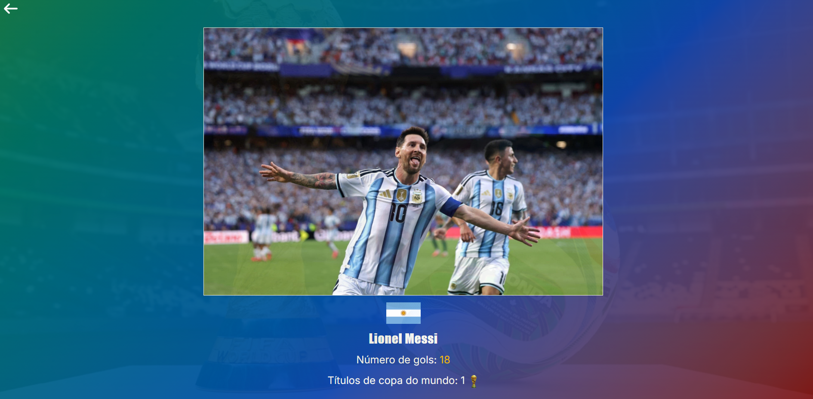

# ⚽ Copa do Mundo - API REST

API REST desenvolvida com Spring Boot para fornecer dados sobre Copas do Mundo, Seleções Campeãs e Jogadores históricos.

📸 Home


📸 Detalhes da Seleção


📸 Detalhes do Jogador



## 🚀 Demonstração

🔗 API Online

https://copa-do-mundo-com-java-postgres-spring.onrender.com

Exemplo:

https://copa-do-mundo-com-java-postgres-spring.onrender.com/selecoes
** Demora alguns segundos para carregar
---

## 🌐 Deploy

Frontend

https://copa-do-mundo-x2iq-qmqcmq3tk-caios-projects-dc5af49f.vercel.app/

Backend

https://copa-do-mundo-com-java-postgres-spring.onrender.com

Banco

Neon PostgreSQL

## 📚 Conceitos aplicados

- Programação Orientada a Objetos
- Spring Boot
- Spring Data JPA
- Hibernate
- DTO Pattern
- Repository Pattern
- Service Layer
- Relacionamentos JPA
- JPQL
- Docker
- Docker Compose
- Deploy com Render
- Banco PostgreSQL em nuvem (Neon)
- Configuração de CORS
- Variáveis de ambiente

## 📸 Funcionalidades

- CRUD de Seleções
- CRUD de Jogadores
- Consulta das seleções campeãs
- Top 5 seleções com mais títulos
- Top 10 artilheiros
- Consulta de detalhes da seleção
- Consulta de detalhes do jogador

---

## 🛠 Tecnologias

### Back-end

- Java 21
- Spring Boot
- Spring Web
- Spring Data JPA
- Hibernate

### Banco de Dados

- PostgreSQL
- Neon PostgreSQL

### DevOps

- Docker
- Docker Compose
- Render

### Ferramentas

- Maven
- Git
- GitHub

---

## ☁️ Infraestrutura

- Docker
- Docker Compose
- Neon PostgreSQL
- Render
- GitHub

---

## 📂 Arquitetura

```
                 Cliente (React)

                        │

                        ▼

                Spring Boot REST API

                        │

        ┌───────────────┴───────────────┐

        ▼                               ▼

 Controllers                     Services

                        ▼

                  Spring Data JPA

                        ▼

                PostgreSQL (Neon)

                        ▲

                   Docker + Render
```

---

## 📁 Estrutura

```
src
 ├── Controller
 ├── DTO
 ├── Models
 ├── Principal
 ├── Repositories
 ├── Service
 └── CopaDoMundoApplication
```

---

## ⚙️ Como executar

### Clone o projeto

```bash
git clone https://github.com/caiob-dev/Copa-do-Mundo-com-Java-Postgres-Spring-Data-JPA
```

### Execute

```bash
./mvnw spring-boot:run
```

ou

```bash
mvn spring-boot:run
```

---

## 🐳 Docker

Build da imagem

```bash
docker build -t copa-backend .
```

Executar

```bash
docker compose up
```

---


## 🔗 Endpoints

### Seleções

```
Método	Endpoint	Descrição
GET	/selecoes	Lista todas as seleções
GET	/selecoes/{id}	Busca seleção
GET	/selecoes/top5	Top 5 campeãs
```

### Jogadores

```
Método	Endpoint	Descrição
GET	/jogadores	Lista jogadores
GET	/jogadores/{id}	Detalhes do jogador
GET	/jogadores/artilheiros	Top 10 artilheiros
```

---

## 🗄 Banco de Dados

Banco hospedado no Neon PostgreSQL.

ORM utilizada:

- Hibernate
- Spring Data JPA

---

## 👨‍💻 Autor

Caio Bomfim
